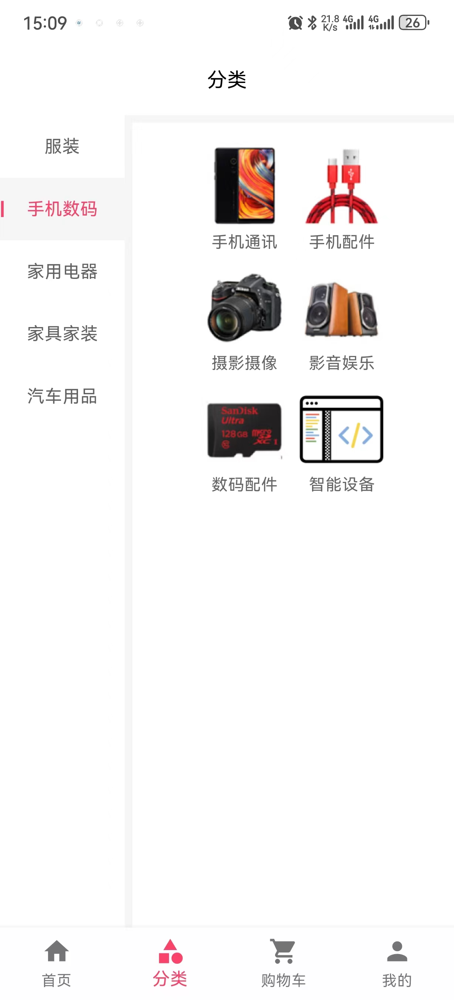
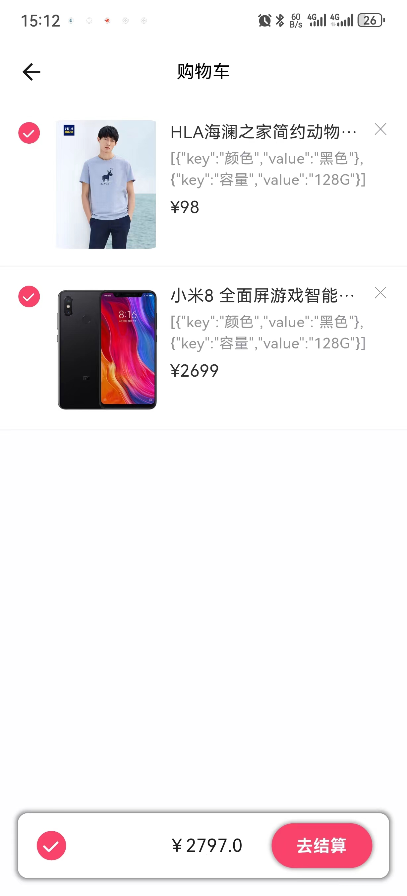
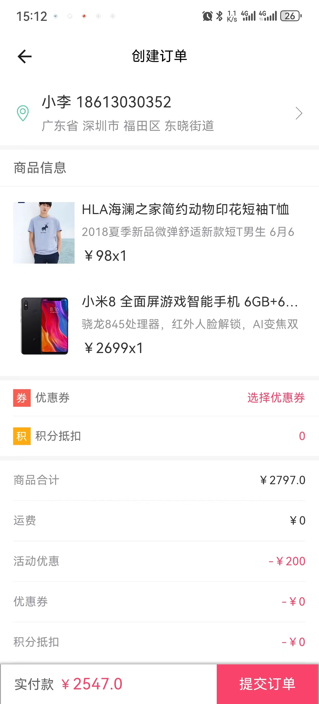
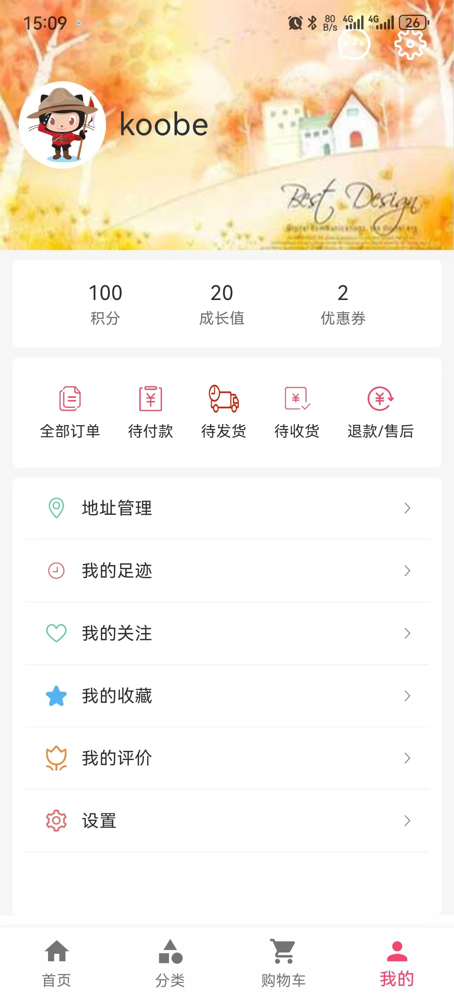
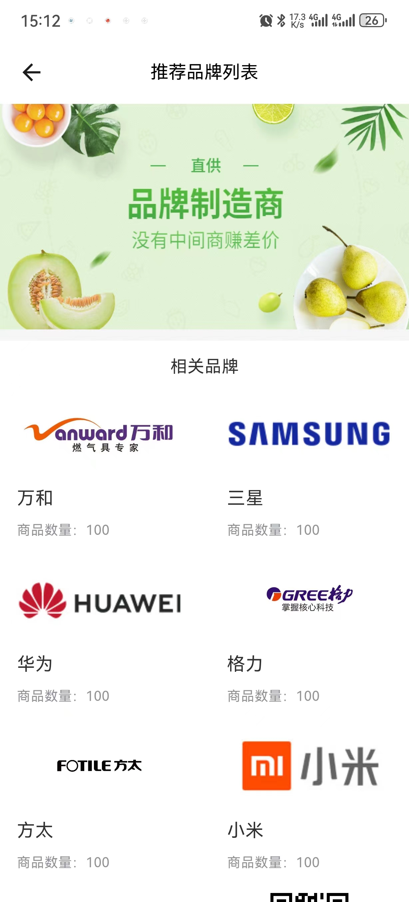
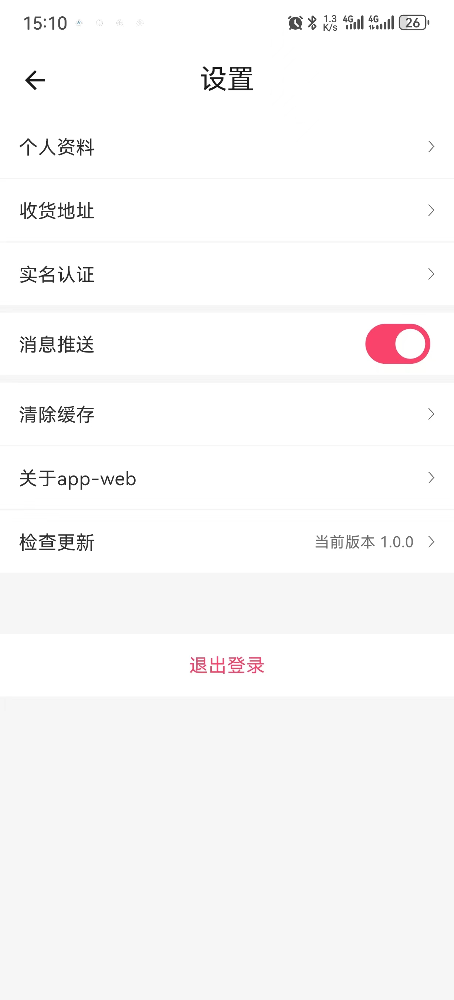

# Flutter Mall 移动端电商系统

**Flutter Mall** 是一个基于 **Flutter** 框架实现的电商系统移动端项目，旨在提供全面的购物体验。主要功能包括首页门户、商品推荐、商品搜索、商品展示、购物车、订单流程、会员中心、客户服务、帮助中心等。

## 功能模块

1. **首页门户**: 提供用户访问应用的入口，展示热门商品、优惠信息等。

2. **商品推荐**: 根据用户的历史行为和个人喜好，推荐个性化商品。

3. **商品搜索**: 强大的商品搜索功能，支持关键字搜索、筛选等。

4. **商品展示**: 以优雅的方式展示商品信息，包括详细描述、价格、评价等。

5. **购物车**: 用户可以将心仪的商品添加到购物车，方便批量购买。

6. **订单流程**: 提供完整的订单流程，包括下单、支付、发货、收货等环节。

7. **会员中心**: 用户可以管理个人信息、查看订单状态、积分等。

8. **客户服务**: 提供在线客服功能，用户可以咨询商品、订单等问题。

9. **帮助中心**: 提供用户常见问题解答、售后政策等信息。

## 技术栈

- **Flutter**: 使用 Flutter 框架进行跨平台移动应用开发。

- **Dart**: 使用 Dart 编程语言，与 Flutter 框架配套使用。

- **Provider**: 使用 Provider 进行状态管理，实现组件之间的数据共享。

- **Dio**: 处理与后端的 HTTP 请求，实现数据的异步获取和提交。

- **Flutter Router**: 实现应用内的导航和路由管理。

# 文档地址
[https://feihua.github.io/](https://feihua.github.io/) 正在完善


## 快速开始

1. 克隆项目代码到本地。
   ```bash
   git clone https://github.com/feihua/flutter_mall.git
   cd flutter-mall
   flutter pub get
   flutter run

## 体验地址
**android** 版本体验地址[flutter-mall-app](https://www.pgyer.com/OoW2Zy)

# 在p40下演示的截图

## 首页


## 分类



## 购物车



## 确认订单



## 支付


## 订单


## 我的



## 登录


## 地址


## 品牌




## 商品详情


## 优惠券


## 设置



# 贡献
欢迎提出问题、建议和贡献代码，一起改进 Flutter Mall 移动端电商系统，为用户提供更好的购物体验。

感谢您的使用和支持！
